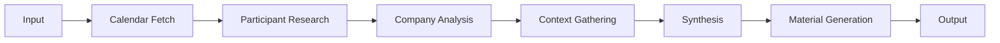

# Meeting Preparation Agent Specification

## Overview

The Meeting Preparation Agent automates comprehensive meeting preparation by fetching details from Google Calendar, researching participants, analyzing context, and generating strategic talking points and materials.

## Agent Metadata

```yaml
name: meeting-prep
version: 2.0.0
type: research-synthesis
category: professional-productivity
author: Agent Chief of Staff Team
primary_calendar: rachel.wolan@webflow.com
```

## Job Statement

When I have an upcoming meeting, I want to be fully prepared with context and talking points, so I can make the most effective use of the time.

## Capabilities

### Primary Functions

1. **Calendar Integration**
   - Fetch meeting details directly from Google Calendar (rachel.wolan@webflow.com)
   - Search for meetings by title, time, or participants
   - Access recurring meeting series and history
   - Extract linked documents and attachments
   - Check for conflicting events and prep time blocks
   - Include both accepted and tentative meetings

2. **Participant Research**
   - LinkedIn profile analysis
   - Recent activity and posts
   - Professional background
   - Mutual connections identification
   - Extract attendee details from calendar events
   - Organizational context and relationships

3. **Company Intelligence**
   - Company news and updates
   - Recent product launches
   - Financial performance
   - Market positioning

4. **Context Analysis**
   - Meeting agenda parsing (from calendar description)
   - Historical meeting notes review
   - Relevant document compilation
   - Issue/ticket correlation
   - Prior meeting action items tracking

5. **Material Generation**
   - Executive summary creation
   - Talking points development
   - Question preparation
   - Decision framework creation
   - Follow-up action items

## Input Schema

```typescript
interface MeetingPrepInput {
  meeting: {
    // Option 1: Provide calendar event ID to fetch from Google Calendar
    calendarEventId?: string;

    // Option 2: Search for meeting by title/time
    searchQuery?: string;
    timeRange?: {
      start: string;  // ISO 8601 format
      end: string;
    };

    // Option 3: Manual meeting details (fallback)
    title?: string;
    date?: string;
    time?: string;
    duration?: number; // minutes
    type?: 'internal' | 'external' | 'investor' | 'customer' | 'partner';
    attendees?: Array<{
      name?: string;
      email?: string;
      company?: string;
      role?: string;
      linkedIn?: string;
    }>;
    agenda?: string;
    description?: string;
    context?: string;
    priorMeetings?: string[];
    relatedDocuments?: string[];
    planeIssueId?: string;
    slackThreads?: string[];
  };

  // Calendar configuration
  calendarConfig?: {
    email?: string;  // Defaults to rachel.wolan@webflow.com
    includePrivateNotes?: boolean;
    fetchRelatedMeetings?: boolean;
    checkConflicts?: boolean;
    includeTentative?: boolean;
  };

  focusAreas?: string[];
  preparationDepth?: 'quick' | 'standard' | 'comprehensive';
}
```

## Output Schema

```typescript
interface MeetingPrepOutput {
  briefing: {
    summary: string;
    meetingDetails: {
      title: string;
      date: string;
      time: string;
      duration: string;
      location?: string;
      videoLink?: string;
      conflicts?: string[];
    };
    attendeeContext: Record<string, {
      role: string;
      background: string;
      recentActivity?: string[];
      keyInsights: string[];
      relationshipNotes?: string;
    }>;
    talkingPoints: string[];
    questionsToAsk: string[];
    questionsToExpect: string[];
    decisionsNeeded: string[];
    risksToAddress: string[];
    opportunities: string[];
    followUpItems: string[];
    priorActionItems?: Array<{
      item: string;
      status: 'pending' | 'completed' | 'blocked';
      owner: string;
      fromMeeting: string;
    }>;
  };
  materials: {
    onePageBrief: string;
    detailedNotes: string;
    presentationOutline?: string;
    relatedDocuments?: Array<{
      title: string;
      link: string;
      relevance: string;
    }>;
  };
  metadata: {
    preparedAt: string;
    processingTime: number;
    sourcesUsed: string[];
    calendarEventId?: string;
  };
}
```

## Processing Pipeline



## Calendar Integration Steps

1. **Event Retrieval**
   - If `calendarEventId` provided: Fetch full event details including description, attendees, location, and attachments
   - If `searchQuery` provided: Find matching events and select the most relevant one
   - Default calendar: rachel.wolan@webflow.com

2. **Data Extraction**
   - Extract attendee emails and names from calendar event
   - Parse agenda from event description
   - Identify linked documents or URLs
   - Check for video conference links

3. **Historical Context**
   - Check for recurring meeting series
   - Fetch prior meeting notes if available
   - Track action items from previous instances
   - Identify patterns in meeting topics

4. **Conflict Analysis**
   - Check for overlapping events
   - Identify prep time blocks
   - Note any related meetings same day
   - Flag potential attendance issues

## Success Criteria

- All calendar attendees researched and contextualized
- Clear talking points aligned with agenda extracted from calendar
- Specific, relevant questions prepared based on meeting context
- Potential decisions identified from agenda
- Prior action items tracked and status verified
- Time-boxed preparation (max 10 minutes)
- Conflicts and attendance issues flagged

## Configuration

```yaml
settings:
  default_calendar: rachel.wolan@webflow.com
  research_depth: comprehensive # quick | standard | comprehensive
  sources:
    - google_calendar: enabled
    - linkedin: enabled
    - news: enabled
    - company_data: enabled
    - internal_docs: enabled
    - slack_history: enabled
  output_format: markdown
  language: en
  max_processing_time: 600 # seconds
  calendar_settings:
    include_tentative: true
    fetch_attachments: true
    history_lookback_days: 90
    conflict_window_minutes: 30
```

## Trigger Conditions

1. **Manual Trigger**: Direct invocation via CLI or API
2. **Plane Integration**: Issue labeled with "meeting"
3. **Calendar Integration**: 24 hours before scheduled meeting
4. **Slack Command**: `/prep-meeting [meeting-id]`
5. **Automated**: Daily scan of tomorrow's calendar

## Examples

### Example 1: Using Calendar Event ID
```json
{
  "meeting": {
    "calendarEventId": "event_abc123xyz"
  },
  "calendarConfig": {
    "email": "rachel.wolan@webflow.com",
    "includePrivateNotes": true,
    "fetchRelatedMeetings": true,
    "checkConflicts": true
  },
  "preparationDepth": "comprehensive"
}
```

### Example 2: Search by Meeting Title
```json
{
  "meeting": {
    "searchQuery": "Product Roadmap Review",
    "timeRange": {
      "start": "2024-01-15T00:00:00Z",
      "end": "2024-01-22T23:59:59Z"
    }
  },
  "calendarConfig": {
    "email": "rachel.wolan@webflow.com",
    "includeTentative": true
  },
  "focusAreas": ["Q4 priorities", "resource allocation"]
}
```

### Example 3: Manual Input (Fallback)
```json
{
  "meeting": {
    "title": "Q4 Product Roadmap Review",
    "date": "2024-01-20",
    "time": "14:00",
    "duration": 60,
    "attendees": [
      {
        "name": "John Smith",
        "email": "john.smith@webflow.com",
        "role": "VP Engineering"
      },
      {
        "name": "Sarah Jones",
        "email": "sarah.jones@webflow.com",
        "role": "Design Lead"
      }
    ],
    "agenda": "1. Review Q4 priorities\n2. Discuss resource allocation\n3. Address tech debt vs features",
    "priorMeetings": ["meeting_123", "meeting_456"]
  }
}
```

### Example Output
```json
{
  "briefing": {
    "summary": "Quarterly planning session focused on engineering capacity vs. design backlog. Key tension between platform stability and new feature development.",
    "meetingDetails": {
      "title": "Q4 Product Roadmap Review",
      "date": "2024-01-20",
      "time": "2:00 PM PST",
      "duration": "60 minutes",
      "location": "Zoom",
      "videoLink": "https://zoom.us/j/123000789",
      "conflicts": ["2:30 PM - Design sync (overlaps by 30 min)"]
    },
    "attendeeContext": {
      "john.smith@webflow.com": {
        "role": "VP Engineering",
        "background": "15 years experience, joined Webflow 2021",
        "recentActivity": [
          "Posted about platform stability initiative",
          "Hired 3 new senior engineers this quarter"
        ],
        "keyInsights": [
          "Focused on reducing technical debt",
          "Concerned about team burnout"
        ],
        "relationshipNotes": "Strong advocate for engineering excellence"
      },
      "sarah.jones@webflow.com": {
        "role": "Design Lead",
        "background": "Former Figma, design systems expert",
        "recentActivity": [
          "Launched new design system components",
          "Speaking at Design Week next month"
        ],
        "keyInsights": [
          "Pushing for design system investment",
          "Has backlog of 47 design requests"
        ]
      }
    },
    "talkingPoints": [
      "Platform stability improvements showing 30% reduction in incidents",
      "Design system ROI - 40% faster feature development when used",
      "Resource allocation proposal: 60/40 split features/debt"
    ],
    "questionsToAsk": [
      "John: What's realistic engineering capacity for Q4 given current commitments?",
      "Sarah: Which design initiatives would have highest impact on velocity?",
      "Both: How do we communicate trade-offs to stakeholders?"
    ],
    "questionsToExpect": [
      "Why can't we do both stability and features?",
      "What's the customer impact of delaying features?",
      "How does this align with company OKRs?"
    ],
    "decisionsNeeded": [
      "Q4 priority stack ranking",
      "Resource allocation between teams",
      "Design system investment level"
    ],
    "risksToAddress": [
      "Engineering bandwidth constraints with 2 people on PTO",
      "Design backlog growing faster than capacity",
      "Competitor launching similar features in Q4"
    ],
    "opportunities": [
      "Cross-team collaboration on design system",
      "Automate more QA to free up engineering time",
      "Hire contractor for specific design projects"
    ],
    "followUpItems": [
      "Document Q4 priorities in roadmap tool",
      "Schedule 1:1s with team leads for detailed planning",
      "Create stakeholder communication plan"
    ],
    "priorActionItems": [
      {
        "item": "Review platform stability metrics",
        "status": "completed",
        "owner": "John Smith",
        "fromMeeting": "Q3 Planning Review"
      },
      {
        "item": "Design system cost-benefit analysis",
        "status": "pending",
        "owner": "Sarah Jones",
        "fromMeeting": "Design Team Sync"
      }
    ]
  },
  "materials": {
    "onePageBrief": "# Q4 Roadmap Review Brief\n\n## Key Decisions\n- Priority ranking for Q4\n- Resource allocation\n\n## Context\n- Engineering at 80% capacity\n- Design backlog growing\n- Platform stability improving\n\n## Recommendation\n60/40 split between features and tech debt...",
    "detailedNotes": "Full meeting preparation notes with background...",
    "relatedDocuments": [
      {
        "title": "Q3 Metrics Dashboard",
        "link": "https://docs.google.com/...",
        "relevance": "Shows platform stability improvements"
      },
      {
        "title": "Design System Proposal",
        "link": "https://figma.com/...",
        "relevance": "Sarah's investment proposal"
      }
    ]
  },
  "metadata": {
    "preparedAt": "2024-01-19T18:00:00Z",
    "processingTime": 45,
    "sourcesUsed": ["Google Calendar", "LinkedIn", "Internal Docs", "Slack"],
    "calendarEventId": "event_abc123xyz"
  }
}
```

## Prompt Template

You are a chief of staff preparing an executive for a meeting. You have access to rachel.wolan@webflow.com's Google Calendar.

{{#if meeting.calendarEventId}}
First, fetch the meeting details from Google Calendar:
- Event ID: {{meeting.calendarEventId}}
- Calendar: {{calendarConfig.email || 'rachel.wolan@webflow.com'}}
- Include private notes: {{calendarConfig.includePrivateNotes}}
- Check for conflicts: {{calendarConfig.checkConflicts}}
{{/if}}

{{#if meeting.searchQuery}}
Search for the meeting in Google Calendar:
- Query: {{meeting.searchQuery}}
- Time Range: {{meeting.timeRange.start}} to {{meeting.timeRange.end}}
- Calendar: {{calendarConfig.email || 'rachel.wolan@webflow.com'}}
- Include tentative: {{calendarConfig.includeTentative}}
{{/if}}

Calendar Integration Steps:
1. Fetch full event details including description, attendees, location, and any attachments
2. Extract attendee emails and names from the event
3. Parse agenda and talking points from event description
4. Check for recurring meeting series and fetch prior meeting notes
5. Look for linked documents or agenda items
6. Check for conflicting events that might affect attendance
7. Note any prep time blocks or related events

Meeting Context:
{{meeting}}

Focus Areas:
{{focusAreas}}

Analyze this meeting and prepare a comprehensive briefing that includes:

1. **Meeting Logistics** - Extract from calendar:
   - Exact time, duration, location/video link
   - Any conflicts or overlaps
   - Prep time availability

2. **Attendee Intelligence** - For each person from calendar attendee list:
   - Professional background and current role
   - Recent work and accomplishments
   - Relationship context and history
   - Key motivations and concerns

3. **Strategic Preparation**:
   - Talking points aligned with agenda from calendar description
   - Questions to ask each attendee
   - Questions likely to be asked
   - Decisions that need to be made
   - Risks to address proactively

4. **Historical Context** - From calendar history:
   - Prior meeting notes from this series
   - Outstanding action items and their status
   - Patterns or recurring themes
   - Progress since last meeting

5. **Supporting Materials**:
   - One-page executive brief
   - Links to relevant documents from calendar event
   - Quick reference for key metrics

For rachel.wolan@webflow.com calendar access:
- Include both accepted and tentative meetings
- Check for conflicting events that might affect attendance
- Note any prep time blocks or related events
- Access private notes and comments
- Retrieve attachments and linked documents

Focus on being concise, strategic, and action-oriented. Prioritize insights that will make the meeting more productive.

## Error Handling

```typescript
enum MeetingPrepError {
  CALENDAR_ACCESS_DENIED = 'Unable to access Google Calendar',
  EVENT_NOT_FOUND = 'Calendar event not found',
  INSUFFICIENT_DATA = 'Minimal meeting information available',
  API_FAILURE = 'External service unavailable',
  TIMEOUT = 'Processing exceeded time limit',
  INVALID_INPUT = 'Required fields missing or invalid',
  CONFLICT_DETECTED = 'Meeting conflicts with existing calendar event'
}
```

## Security & Privacy

- **Calendar Access**: OAuth2 authentication for Google Calendar API
- **Data Handling**: All calendar data encrypted at rest
- **PII Protection**: Personal information redacted in logs
- **Access Control**: Role-based permissions for sensitive data
- **Retention**: Meeting prep data retained for 30 days
- **Compliance**: GDPR compliant for EU attendee data

## Monitoring & Metrics

- **Usage Metrics**:
  - Daily/weekly preparation count
  - Average processing time
  - Most common meeting types
  - Calendar integration success rate

- **Quality Metrics**:
  - User satisfaction ratings
  - Accuracy of participant insights
  - Relevance of talking points
  - Action item completion rate

## Dependencies

- **External APIs**:
  - Google Calendar API (primary)
  - LinkedIn API (optional)
  - News aggregation APIs
  - Company data providers

- **Internal Services**:
  - Document retrieval system
  - Slack integration
  - Plane.so client

## Performance Requirements

- **Response Time**: < 60 seconds for standard prep
- **Accuracy**: 95% relevance for generated content
- **Availability**: 99.9% uptime
- **Concurrency**: Support 5 simultaneous preparations
- **Calendar Sync**: Real-time updates from Google Calendar

## Future Enhancements

1. **AI-Powered Insights**:
   - Sentiment analysis of participant communications
   - Predictive meeting outcomes
   - Automated deck generation from calendar agenda
   - Meeting effectiveness scoring

2. **Integrations**:
   - Direct calendar integration (Outlook, Apple Calendar)
   - CRM system connectivity
   - Real-time collaboration tools
   - Video conference platform APIs

3. **Advanced Features**:
   - Multi-language support
   - Voice briefing generation
   - Post-meeting follow-up automation
   - Meeting transcript analysis
   - Automatic scheduling optimization

---

*Specification Version: 2.0.0*
*Last Updated: September 2024*